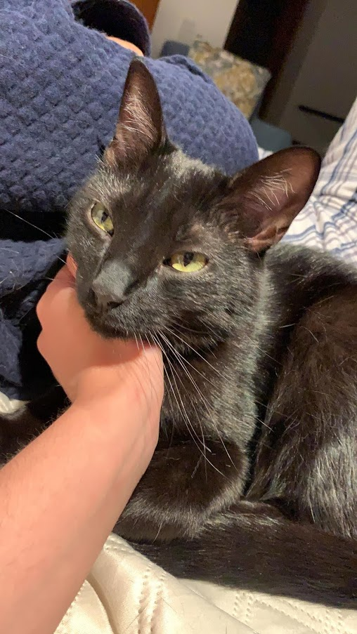
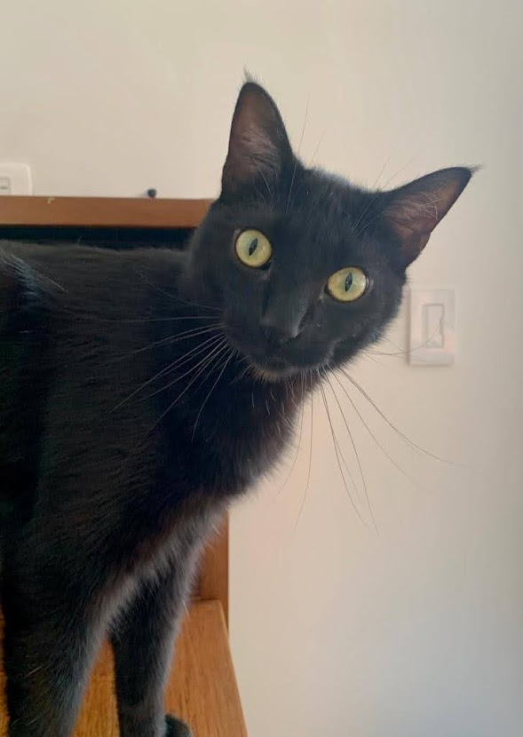

# Hi! 
I'm Arturo Amaya. I'm 21. I'm a Computer Engineering major here at UCSD. 

In this doc:
- [Hi!](#hi)
  - [Have a free cat picture first:](#have-a-free-cat-picture-first)
  - [A little about me:](#a-little-about-me)
  - [I still like some things](#i-still-like-some-things)
  - [Some things I want to try during this quarter:](#some-things-i-want-to-try-during-this-quarter)

## Have a free cat picture first:
This is a picture of my cat:

Here's another picture of my cat:

His name is Mapalé and he's an absolute cutie.

## A little about me:
I've lived in Virginia, Mexico and Colombia, so the answer to the question "*Where are you from*?" is a long one. However, the answer to the question "*what do you want to do once you graduate?*" is a short one - I have **no** idea.

Over the past year I haven't really coded all that much aside from a set of PHP database programs. Learning PHP was interesting - I had no idea it used an `=`, `==` *and* `===`. I didn't like sitting down for several hours to write code when I was already inside all day trying to not contract COVID. That's partly why I've waited so long to take this class.

Actually, I kind of lost interest in a lot of things while at home. It's really nice to be near campus meeting new people and all that. :) Hopefully I can regain some if not all of my enjoyment for coding now that we're back.

## I still like some things
Some (but not all) of the things I still enjoy are:
- watching [football](note1.md) (the not-American kind).
- watching football analysis videos from [Tifo Football](https://www.youtube.com/channel/UCGYYNGmyhZ_kwBF_lqqXdAQ) and Jordan Klepper videos like [this one](https://www.youtube.com/watch?v=I6H7urz-HgA). 
- swimming
- ~~not spraining my medial ligament~~ walking
- craft beers - [specifically super bitter IPAs](note2.md)
- really dumb jokes and standup comedy
- playing smash
- [bad movies](note3.md)
- sitcoms

Speaking of, my 5 favorite sitcoms are:
1. Futurama
2. Friends
3. Ted Lasso:
    The 
    >oops, innit

    >well said 

    [exchange](https://www.reddit.com/r/TedLasso/comments/k4sxmx/best_character_arc/) is so funny to me. You should watch Ted Lasso.
4. Seinfeld
5. Brooklyn Nine-Nine

## Some things I want to try during this quarter:
- [x] learn to ride a skateboard
- [x] learn to ride a onewheel
- [ ] make my own kombucha and beer
- [ ] surf club!
- [ ] a calendar tool for webreg

